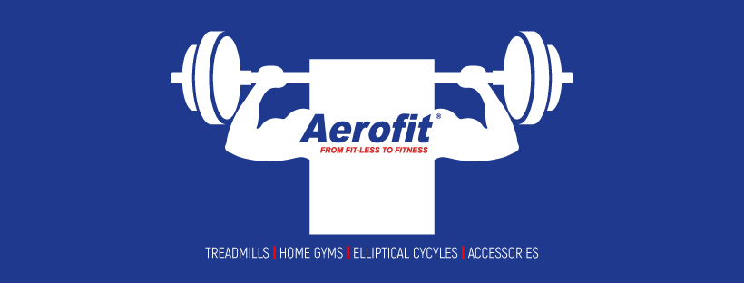

# Aerofit EDA

Aerofit a leading fitness equipment company, has multiple treadmill models in the market. For every past purchase, we have data of customers (features) with us, with this data we can profile the customer for better targeting and recommendations. Additionally, we will also find the conditional probability of purchase of the product for a given customer profile or features.

**Methods and Techniques used:** EDA and Probability (No clustering methods)

**Dataset**

The dataset contains past purchase details of 3 main treadmills of Aerofit with models KP281, KP481, and  KP781 (in order of entry-level to top end) along with customer features like age, gender, education, marital status and so on.

## Data Science Lifecycle
1. Introduction and Aim of the Project
2. Basic exploration and data wrangling
3. Visualization and exploration
4. Results and insights
5. Business recommendations